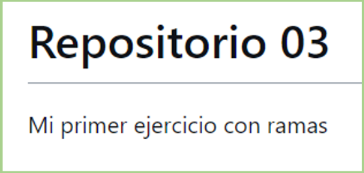

# Ejercicio 3: FAST FORWARD

3.1. Crea un directorio llamado repo03 (tu decides como lo haces) con un fichero readme.md vacío, haz un commit súbelo a un repositorio rmoto que tendrá el mismo nombre repo03.

__Repositorio local__
~~~
    git init repo03
    cd repo03
    touch readme.md
    git add readme.md
    git commit -m "readme.md vacío"
~~~

__Repositorio remoto__
~~~
    1. Entrar a GitHub
    2. Crear nuevo repositorio
    3. Añadir nombre al nuevo repositorio
        "Ejercicios-de-formacion-tareas-git-repo03"
    4. Copiar la dirección del repositorio remoto
        (se utilizará para vincular con el repositorio local)
~~~

__Repositorio local__
~~~
    git branch -M main
    git remote add origin https://github.com/juang3/Ejercicios-de-formacion-tareas-git-y-markdown-repo03.git
    git push -u origin main
~~~

3.2. Crea una rama con tu nombre y la fecha por ejemplo juan03062022) __desde la que editaremos el fichero__

~~~
    git branch juan03062022
    git checkout juan03062022
~~~

3.3. Desde tu rama edita el fichero readme.md para que quede la siguiente manera.

~~~
    1. Entrar en archivo readme.md
    2. Eliminar el contenido y se ha añadido:
       1.  # Repositorio 03
       2.  Mi primer ejercicio con ramas
~~~

3.4. Haz un commit en tu rama
~~~ html
    git add readme.md
    git commit 
    <!-- Comentando los cambios realizados en el archivo -->
~~~

3.5. Haz un push hacia la nube desde la rama juan03062022
~~~
    git push --set-upstream origin juan03062022-escenario1
~~~

3.6. Fusiona tu rama con main
~~~
    <!-- Cambio a la rama donde se realizará la fusión -->
    git checkout main

    <!-- Trayendo los elementos de la rama juan03062022escenario1 -->
    git push --set-upstream origin juan03062022-escenario1 
~~~

